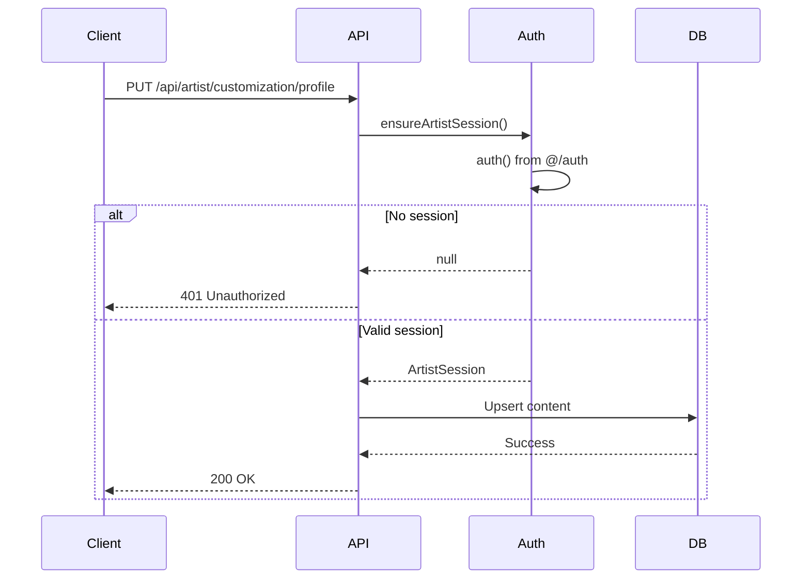

# CMS API Reference

> Endpoints API pour le CMS Loire Gallery

## Base URL

```
/api/artist/customization
```

---

## Endpoints

### GET /api/artist/customization/[key]

Récupère le contenu d'une page CMS.

**Authentification:** Required (Artist)

**Paramètres:**
| Param | Type | Description |
|-------|------|-------------|
| `key` | `string` | Clé de la page: `profile`, `poster`, `banner` |

**Réponse 200:**
```json
{
  "blocks": [
    {
      "id": "uuid",
      "type": "text",
      "content": "<p>Mon contenu</p>",
      "style": { "padding": "16px" }
    }
  ],
  "theme": {
    "primaryColor": "#4ecdc4",
    "fontFamily": "Inter"
  },
  "meta": {
    "title": "Page titre",
    "description": "Description SEO"
  },
  "settings": {
    "layout": "flow"
  }
}
```

**Codes d'erreur:**
| Code | Description |
|------|-------------|
| 401 | Non authentifié |
| 404 | Page non trouvée |

---

### PUT /api/artist/customization/[key]

Sauvegarde ou publie une page CMS.

**Authentification:** Required (Artist)

**Body:**
```json
{
  "blocks": [...],
  "theme": {...},
  "meta": {...},
  "settings": {...},
  "action": "draft" | "publish"
}
```

**Validation Zod:**
- `blocks`: Array de Block (voir schema)
- `theme`: Objet optionnel
- `meta.title`: String max 60 chars
- `meta.description`: String max 160 chars

**Réponse 200:**
```json
{
  "success": true,
  "status": "draft" | "published",
  "publishedAt": "2024-01-13T20:00:00Z"
}
```

**Codes d'erreur:**
| Code | Description |
|------|-------------|
| 400 | Validation failed |
| 401 | Non authentifié |
| 500 | Erreur serveur |

---

## Schémas

### Block Schema

```typescript
const BlockSchema = z.object({
  id: z.string().uuid(),
  type: z.enum(['text', 'image', 'container', 'spacer', ...]),
  content: z.string(),
  style: BlockStyleSchema.optional(),
  x: z.number().optional(),  // Pixels (FreeForm)
  y: z.number().optional(),  // Pixels (FreeForm)
  children: z.lazy(() => z.array(BlockSchema)).optional(),
  tag: z.string().optional(),
});
```

### BlockStyle Schema

```typescript
const BlockStyleSchema = z.object({
  width: z.string().optional(),
  height: z.string().optional(),
  padding: z.string().optional(),
  margin: z.string().optional(),
  backgroundColor: z.string().optional(),
  color: z.string().optional(),
  fontSize: z.string().optional(),
  fontFamily: z.string().optional(),
  textAlign: z.enum(['left', 'center', 'right']).optional(),
  borderRadius: z.string().optional(),
  position: z.enum(['relative', 'absolute']).optional(),
});
```

### ContentPayload Schema

```typescript
const ContentPayloadSchema = z.object({
  blocks: z.array(BlockSchema),
  theme: z.record(z.unknown()).optional(),
  meta: z.object({
    title: z.string().max(60),
    description: z.string().max(160),
    canonicalUrl: z.string().url().optional(),
  }).optional(),
  settings: z.record(z.unknown()).optional(),
  action: z.enum(['draft', 'publish']).optional(),
});
```

---

## Sécurité

### Sanitization

Avant sauvegarde, le contenu est sanitizé:

1. **HTML:** `sanitizeTextHtml()` - DOMPurify
2. **CSS:** `sanitizeBlockStylesDeep()` - Whitelist properties
3. **Embeds:** `sanitizeEmbedBlock()` - Whitelist domains

### Auth Flow



---

## Cache & Revalidation

Sur publication (`action: 'publish'`):

```typescript
revalidatePath(`/artist/${slug}`);
revalidateTag('artists-list');
revalidateTag('featured-artists');
revalidateTag('artist-posters');
```

---

## Rate Limiting

| Endpoint | Limite |
|----------|--------|
| GET | 100/min |
| PUT | 20/min |

---

*Voir aussi:* [architecture.md](./architecture.md) | [block-sdk.md](./block-sdk.md)
