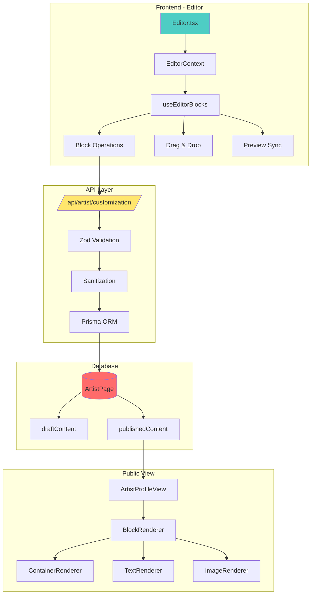
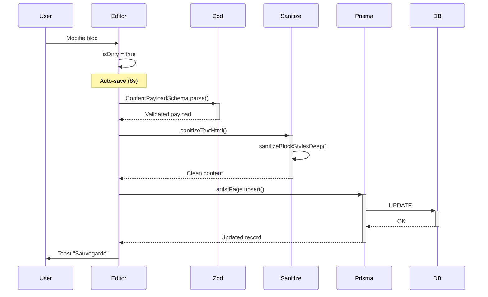
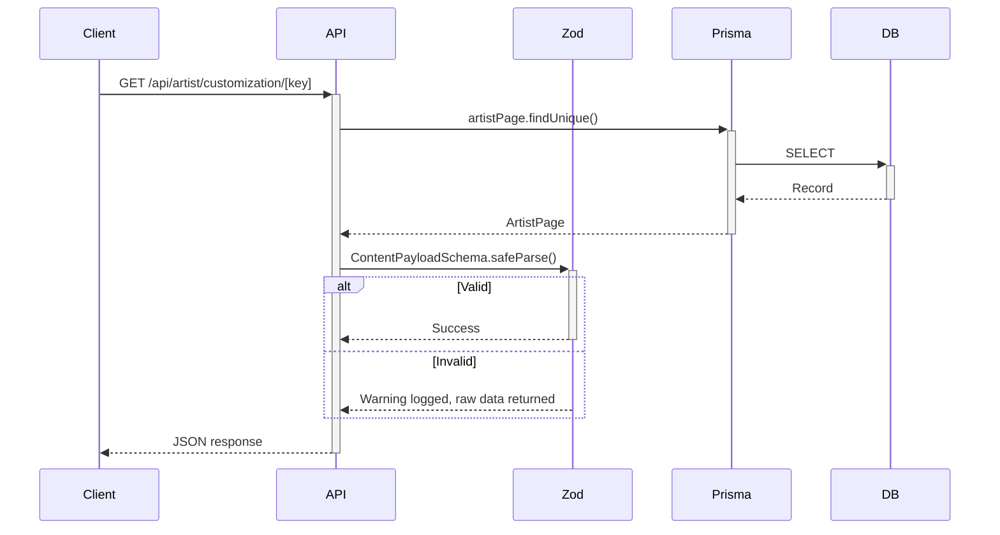
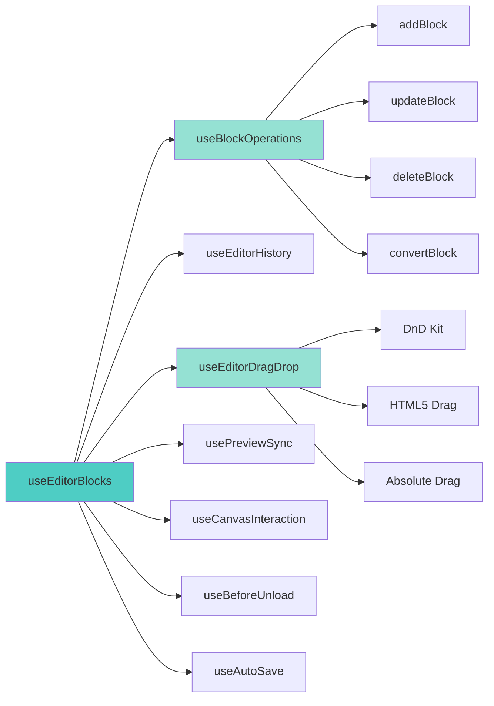
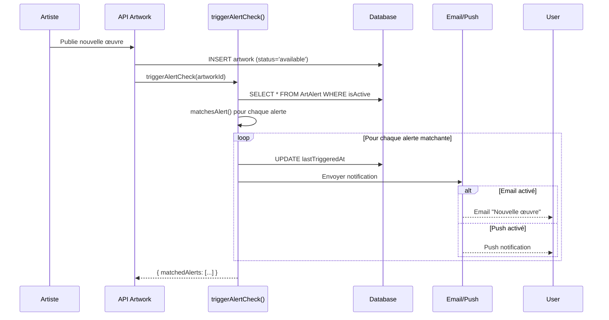

# CMS Architecture

> Architecture complète du système CMS de Loire Gallery

## Vue d'Ensemble



## Data Flow

### Save Operation



### Read Operation (GET)



## Fichiers Clés

| Fichier | Responsabilité | Lignes |
|---------|----------------|--------|
| `components/dashboard/Editor.tsx` | Éditeur principal | ~4500 |
| `components/dashboard/editor/EditorContext.tsx` | State management | ~160 |
| `lib/cms/blockRegistry.ts` | Registry des blocs | ~200 |
| `lib/cms/blockValidation.ts` | Validation blocs | ~400 |
| `lib/cms/blockPositioning.ts` | Calcul positions | ~100 |
| `src/lib/cms/style.ts` | Compositing styles | ~300 |
| `src/lib/cmsSchema.ts` | Schémas Zod | ~200 |

## Hooks Architecture



## Block System

### Block Types

| Type | Catégorie | Renderer |
|------|-----------|----------|
| `text` | Content | TextRenderer |
| `image` | Media | ImageRenderer |
| `container` | Layout | ContainerRenderer |
| `spacer` | Layout | SpacerRenderer |
| `embed` | Media | EmbedRenderer |
| `artist-name` | Artist | TextRenderer |
| `artist-photo` | Artist | ImageRenderer |
| `artist-bio` | Artist | TextRenderer |

### Block Interface

```typescript
interface Block {
  id: string;
  type: BlockType;
  content: string;
  style?: BlockStyle;
  x?: number;  // Pixels (FreeForm)
  y?: number;  // Pixels (FreeForm)
  children?: Block[];
}
```

## Sécurité

| Couche | Protection |
|--------|------------|
| Input | Zod validation |
| XSS | sanitizeTextHtml() |
| CSS Injection | sanitizeBlockStylesDeep() |
| Embed | sanitizeEmbedBlock() whitelist |
| Auth | ensureArtistSession() |

## Variables d'Environnement

```bash
DATABASE_URL          # PostgreSQL connection
DIRECT_URL            # Direct DB (bypasses pooler)
NEXTAUTH_SECRET       # Auth encryption
```

---

## Système d'Alertes Personnalisées

Les alertes permettent aux collectionneurs de recevoir des notifications lorsqu'une nouvelle œuvre correspond à leurs critères.

### Flow de Déclenchement



### Schéma ArtAlert

| Champ | Type | Description |
|-------|------|-------------|
| `id` | String | Identifiant unique |
| `userId` | String | Propriétaire de l'alerte |
| `artistIds` | String[] | Artistes suivis (filtre optionnel) |
| `categoryIds` | String[] | Catégories ciblées |
| `styles` | String[] | Styles recherchés (abstrait, figuratif...) |
| `mediums` | String[] | Techniques (huile, acrylique...) |
| `priceMin` | Int? | Prix minimum |
| `priceMax` | Int? | Prix maximum |
| `emailEnabled` | Boolean | Notification par email |
| `pushEnabled` | Boolean | Notification push |
| `frequency` | Enum | immediate / daily / weekly |
| `isActive` | Boolean | Alerte activée |
| `lastTriggeredAt` | DateTime? | Dernière notification |

### Fonctions Clés (`src/actions/alerts.ts`)

| Fonction | Description |
|----------|-------------|
| `createAlert()` | Crée une nouvelle alerte |
| `updateAlert()` | Modifie les critères |
| `deleteAlert()` | Supprime l'alerte |
| `getUserAlerts()` | Liste les alertes utilisateur |
| `toggleAlertActive()` | Active/désactive |
| `triggerAlertCheck()` | Vérifie les matchs pour une œuvre |

---

*Voir aussi:* [block-sdk.md](./block-sdk.md) | [api.md](./api.md)
