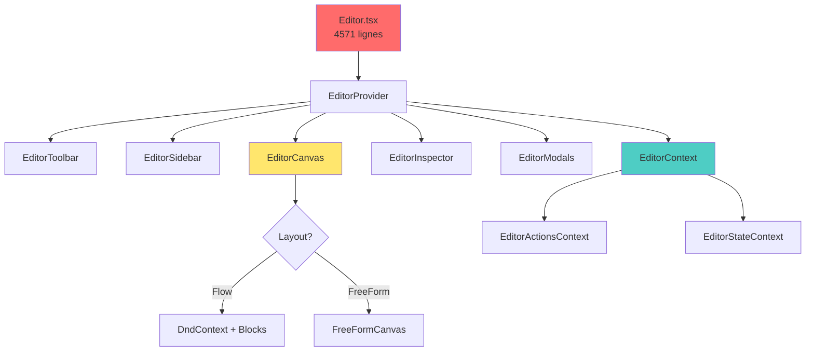
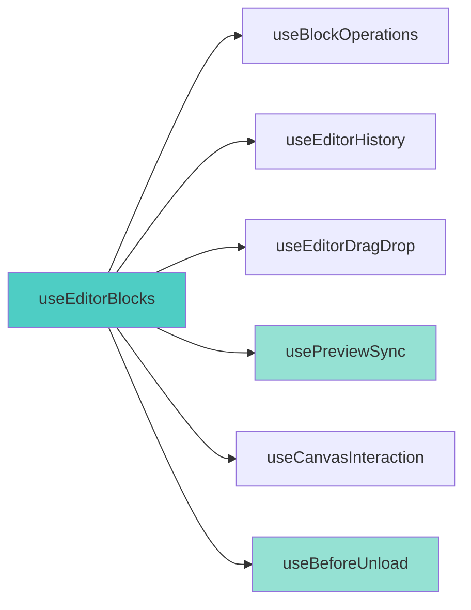
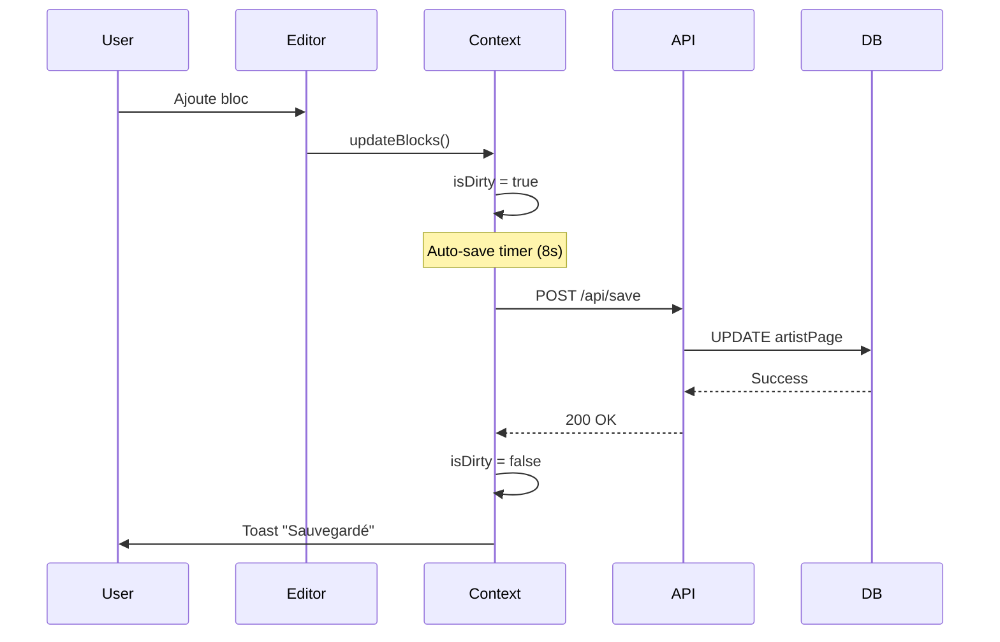
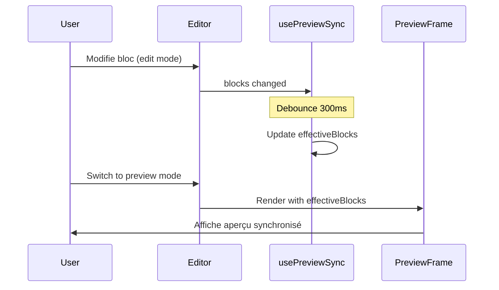
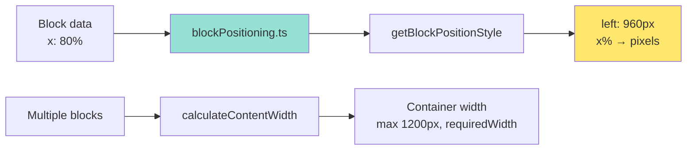

# Architecture de l'Éditeur CMS

## Vue d'Ensemble des Composants



## Hooks Architecture



## Data Flow - Save Operation



## Data Flow - Preview Sync



## Répertoire des Fichiers

```
components/dashboard/
├── Editor.tsx (4571 lignes - ⚠️ À REFACTORER)
├── EditorLazy.tsx
├── EditorUnifiedMenu.tsx
├── FreeFormCanvas.tsx (410 lignes)
├── PreviewFrame.tsx (46 lignes) 
├── editor/
│   ├── EditorContext.tsx (163 lignes) ✅
│   ├── EditorErrorBoundary.tsx ✅ NEW (P0)
│   ├── EditorHelpers.ts (à créer - P1)
│   ├── hooks/
│   │   ├── useEditorBlocks.ts
│   │   ├── useBlockOperations.ts
│   │   ├── useEditorHistory.ts
│   │   ├── useEditorDragDrop.ts
│   │   ├── usePreviewSync.ts ✅
│   │   ├── useCanvasInteraction.ts
│   │   ├── useBeforeUnload.ts ✅ NEW (P0)
│   │   ├── useEditorAccessibility.ts
│   │   ├── useEditorBanner.ts
│   │   └── useQuickSections.ts
│   └── layout/
│       ├── EditorLayout.tsx (404 lignes)
│       ├── EditorToolbar.tsx
│       ├── EditorSidebar.tsx
│       └── EditorInspector.tsx
└── lib/cms/
    ├── blockPositioning.ts ✅
    ├── themeTokens.ts
    └── templates.ts
```

## Context Split Pattern

L'éditeur utilise un **split context pattern** pour optimiser les re-renders :

```typescript
// Deux contextes séparés
const EditorActionsContext = createContext<EditorActions>(null);
const EditorStateContext = createContext<EditorState>(null);

// Hooks spécifiques
export const useEditorActions = () => useContext(EditorActionsContext);
export const useEditorState = () => useContext(EditorStateContext);

// Hook combo (utiliser avec précaution)
export const useEditorContext = () => ({
  ...useEditorActions(),
  ...useEditorState()
});
```

**Avantages** :
- Composants n'utilisant que les actions ne re-render pas quand state change
- Séparation claire responsabilités

**Règle** : Préférer `useEditorActions()` ou `useEditorState()` plutôt que `useEditorContext()`

## Block Positioning System



**Fichier** : `lib/cms/blockPositioning.ts`

Fonctions clés :
- `getBlockPositionStyle()` : Convertit positions % → pixels
- `calculateContentWidth()` : Calcule largeur requise pour tous blocs
- `calculateContentHeight()` : Calcule hauteur requise

## Type System

**Fichier principal** : `types/cms.ts`

```typescript
type BlockType = 'text' | 'image' | 'gallery' | 'video' | ...;

interface BaseBlock {
  id: string;
  type: BlockType;
  style?: BlockStyle;
  x?: number; // Percentage 0-100
  y?: number; // Pixels
  width?: string | number;
  height?: string | number;
  // ...
}

// Block types extend BaseBlock
interface TextBlock extends BaseBlock {
  type: 'text';
  content: string;
  // ...
}
```

## Performance Optimizations

1. **React.memo** sur BlockRenderer
2. **useMemo** pour themeTokens
3. **useCallback** dans hooks
4. **Debouncing** :
   - Auto-save : 8000ms
   - Preview sync : 300ms
5. **Dynamic imports** pour modals

## Security

- **XSS Protection** : `sanitizeTextHtml()` pour contenu riche
- **beforeunload** : Warning si modifications non sauvegardées ✅ (P0)
- **Error Boundary** : Récupération gracieuse ✅ (P0)

## Améliorations P0/P1

### P0 - Sécurité ✅
- beforeunload protection
- Auto-save UX (toast)
- Error Boundary

### P1 - En cours 🔄
- Documentation (ce fichier)
- Tests E2E (Playwright)
- Refactoring Editor.tsx (4571 → <500 lignes)

---

*Dernière mise à jour : 2026-01-13*
