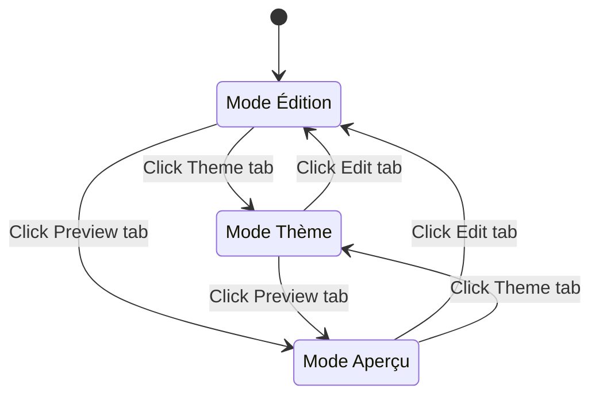
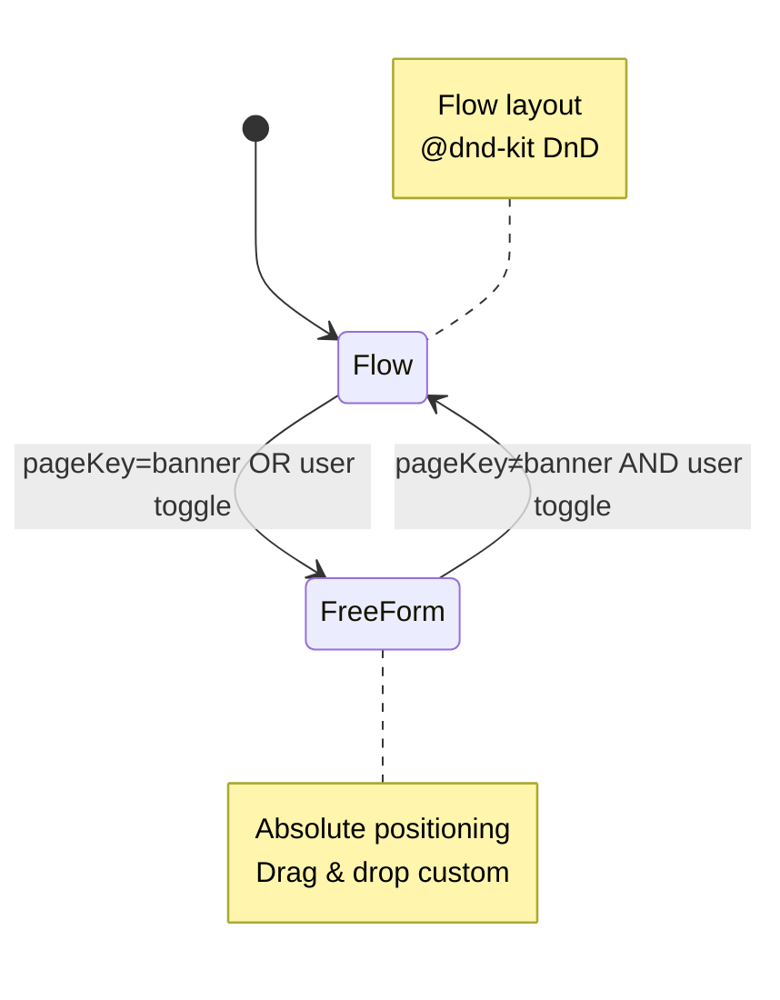
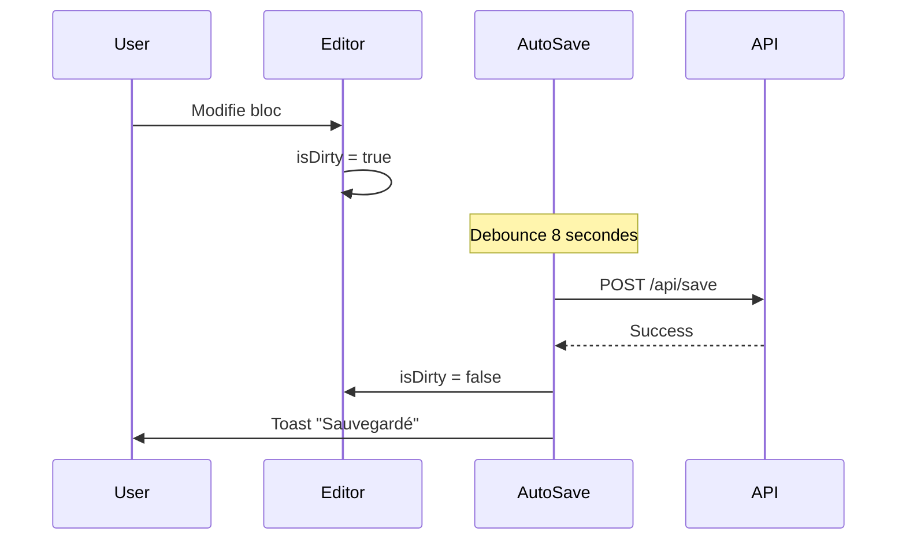
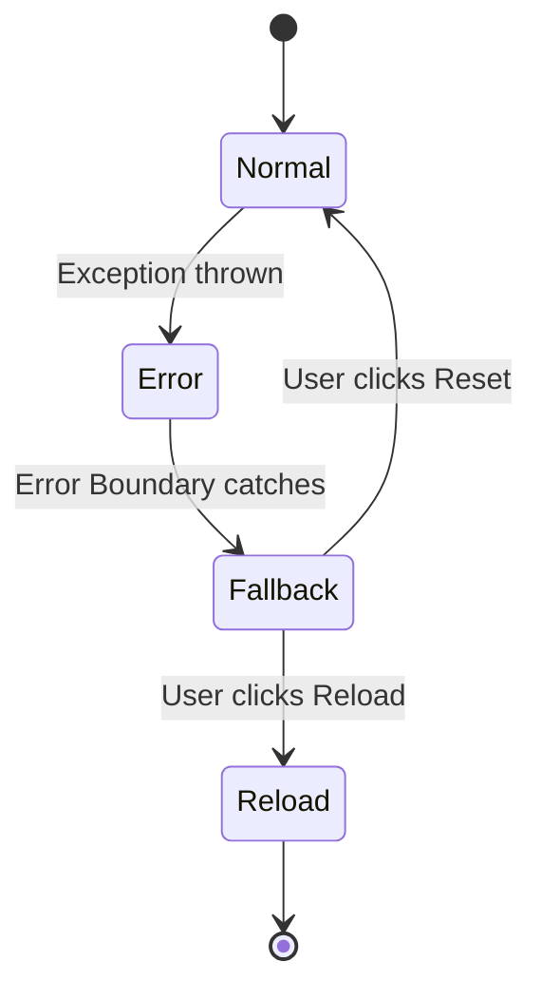

# Editor State Machine

## Vue d'Ensemble

L'éditeur CMS a plusieurs dimensions d'état qui peuvent se combiner :

- **viewMode** : `'edit'` | `'theme'` | `'preview'`
- **pageKey** : `'profile'` | `'banner'` | `'poster'`
- **layout** : `'flow'` | `'freeForm'`
- **device** : `'desktop'` | `'mobile'` (mobile editor removed)

## State Diagrams

### View Modes



**Règles** :
- `viewMode` change via tabs dans toolbar
- En mode Preview : lecture seule, pas d'édition

### Layout Modes



**Règles** :
- Banner **force** FreeForm mode
- Poster/Profile par défaut en Flow, toggle possible

## États Valides - Matrice

| viewMode | pageKey | layout | Valide | Notes |
|----------|---------|--------|--------|-------|
| edit | profile | flow | ✅ | État par défaut profile |
| edit | profile | freeForm | ✅ | User a toggleé |
| edit | banner | flow | ❌ | **Banner force freeForm** |
| edit | banner | freeForm | ✅ | État obligatoire banner |
| edit | poster | flow | ✅ | État par défaut poster |
| edit | poster | freeForm | ✅ | User a toggleé |
| theme | * | * | ✅ | Theme mode fonctionne partout |
| preview | * | * | ✅ | Preview lecture seule partout |

## Transitions Interdites

1. `banner + flow` → **IMPOSSIBLE** (force freeForm)
2. `viewMode=preview + édition` → **BLOQUÉ** (mode lecture seule)

## Gestion dans le Code

**Fichier** : `Editor.tsx`

```typescript
const isBanner = pageKey === 'banner';
const isPoster = pageKey === 'poster';
const isFreeForm = isBanner || (/* user toggled */);

// Render
{viewMode === 'edit' ? (
  isFreeForm ? (
    <FreeFormCanvas />
  ) : (
    <DndContext>
      {/* Flow layout */}
    </DndContext>
  )
) : viewMode === 'preview' ? (...) : (...)}
```

## Auto-Save State Flow



## Error Handling State



---

*Dernière mise à jour : 2026-01-13*
